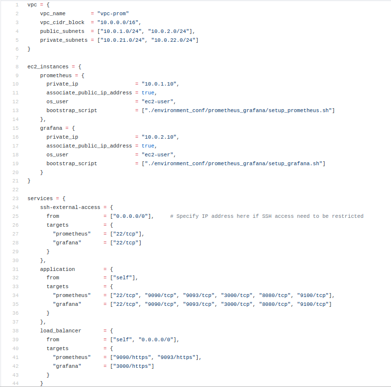
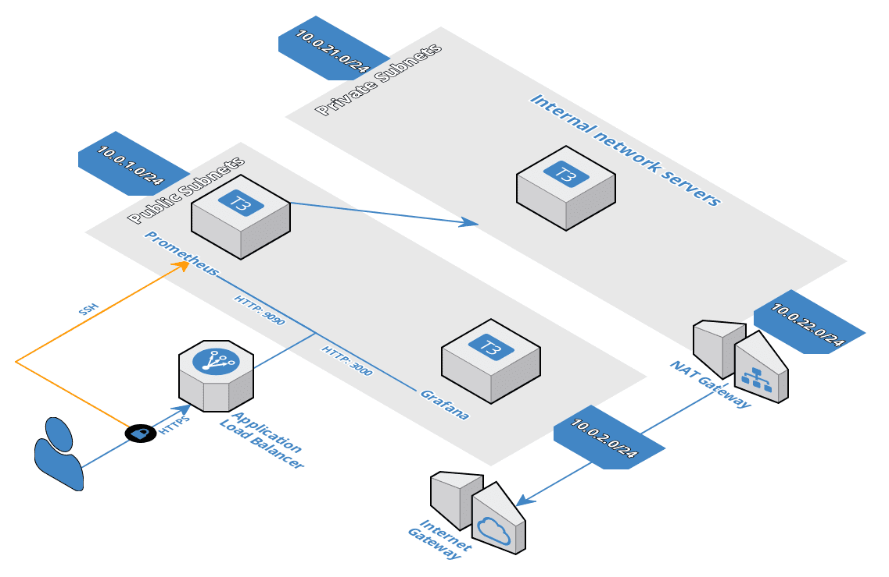
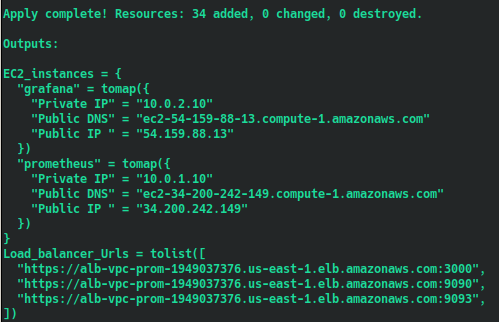
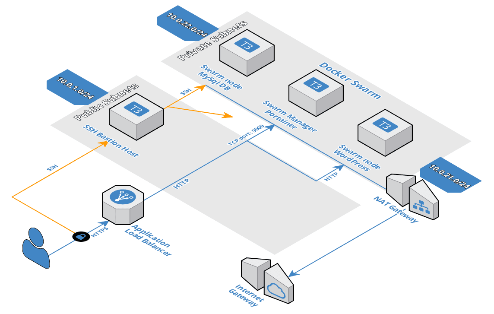

# Modeling AWS EC2 multi-tiered web application environments via Map data collections in Terraform

- Modeling AWS multi-tiered EC2 Linux application deployments using simple user-friendly JSON-like environment configurations, map data collections and Bash provisioning scrips.
- Automate provisioning of AWS EC2 environments consisting of Linux server instances, VPC, public and private networks, NAT gateway, Internet Gateway, Application Load Balancer (ALB) and application server Target Groups.

## Prometheus-Grafana monitoring application

- Configuration of monitoring application environment of Prometheus and Grafana servers:

- Application architecture in AWS:

- Terraform script results:

## WordPress application

